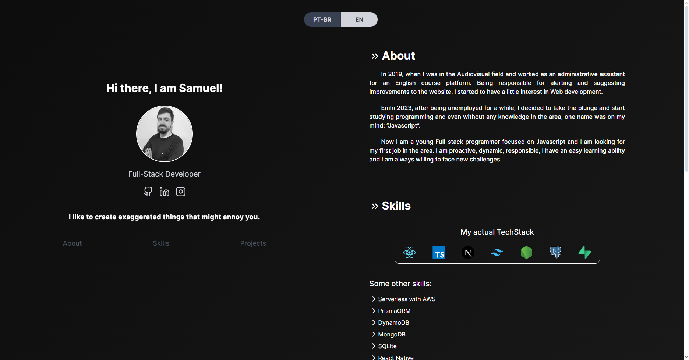

# Portfólio - Samuel Machado

Esse é meu portfólio de desenvolvedor Web FullStack, um projeto simples usando feito no Next.js 14 no qual irei exibir meus projetos pessoais.
Você pode acessar o portfólio clicando [aqui](https://samuelmachado.dev.br).

## Tecnologias
### Base:
- Next.js 14
- Typescript
- Pnpm

### Linting:
- Eslint
- Prettier
- Lint-staged
- Commitlinting
- Husky
- EditorConfig

### UI:
- Tailwind CSS
- Aceternity UI
- Framer-motion (animações)

### Sinta-se livre para deixar seu feedback e sugestões!

_____________________________________________________________________

# English version.
# Portfolio - Samuel Machado
This is my personal FullStack Web Developer portfolio, a simple project created with Next.js 14 with the purpose of showcasing my personal projects.
You can access my portfolio clicking [here](https:/samuelmachado.dev.br)

### Base:
- Next.js 14
- Typescript
- Pnpm

### Linting:
- Eslint
- Prettier
- Lint-staged
- Commitlinting
- Husky
- EditorConfig

### UI:
- Tailwind CSS
- Aceternity UI
- Framer-motion (animations)

### Feel free to share your feedback and suggestions!
